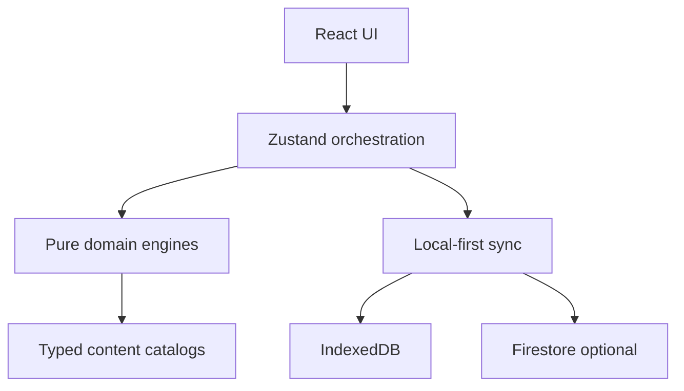
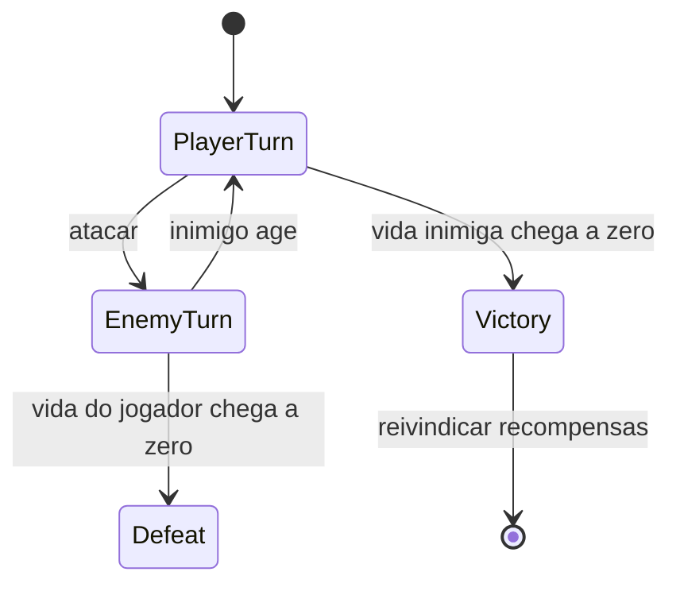

# Arquitetura

## Fronteiras

- `content`: definições imutáveis e tipadas; IDs estáveis.
- `domain`: regras puras, resultados explícitos e nenhum conhecimento de React.
- `state`: transforma ações da interface em eventos de domínio e commits de save.
- `persistence/services`: schema, armazenamento e integrações externas.
- `ui`: apresenta estado e envia comandos; não calcula recompensas.

## Combate

A batalha usa uma máquina de estados determinística:

O estado inclui turno, HP, guarda, cooldowns, log, recompensa calculada e flag de reivindicação. A UI nunca salta transições.

## Essência e Vínculo

Ressonância pertence a cada item vinculado e governa seu progresso. Essência bruta alimenta uma barra global; cada limiar completo acrescenta exatamente um Ponto de Essência ao pool compartilhado. Nodes validam domínio, pré-requisitos, Grau e saldo antes do commit atômico.

## Persistência

Cada mudança cria uma nova revisão do `GameSave`. Escritas são serializadas localmente; a sincronização de nuvem é opcional. Regras de domínio podem ser testadas sem navegador, IndexedDB ou Firebase.
