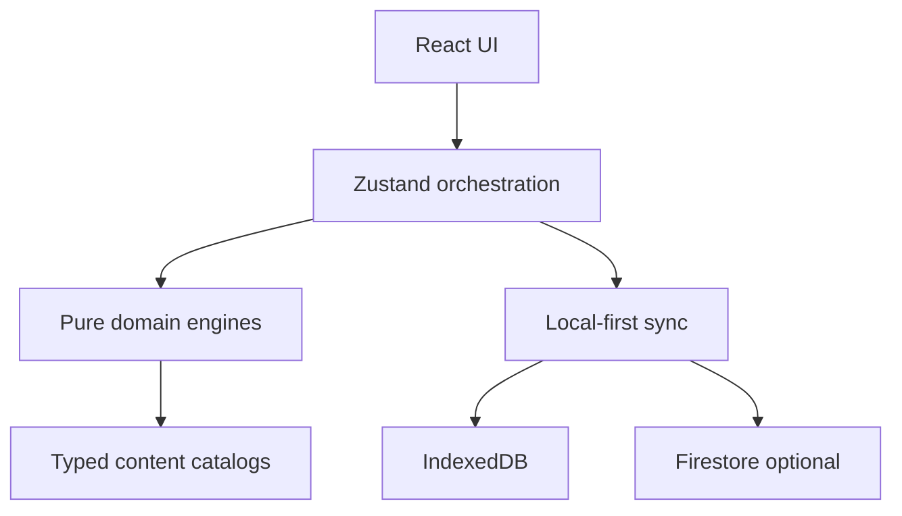
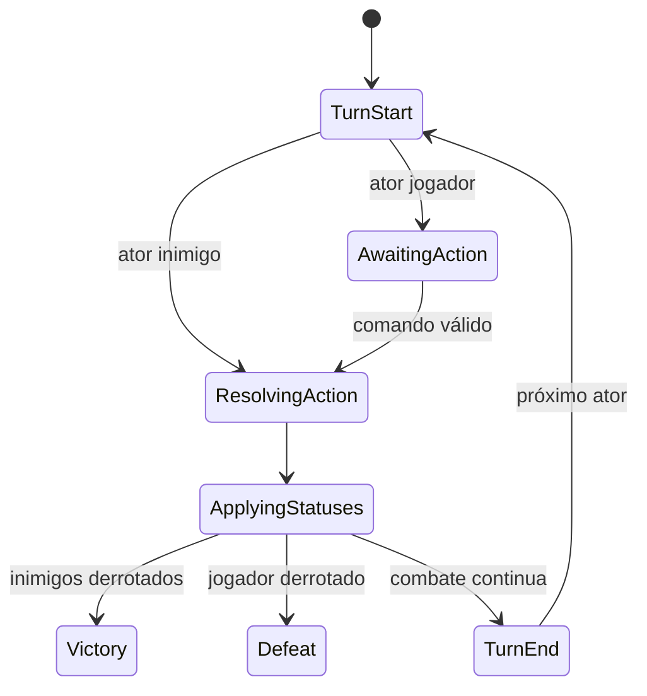

# Arquitetura

## Fronteiras

- `content`: definições imutáveis e tipadas; IDs estáveis.
- `domain`: regras puras, resultados explícitos e nenhum conhecimento de React.
- `state`: transforma ações da interface em eventos de domínio e commits de save.
- `persistence/services`: schema, armazenamento e integrações externas.
- `ui`: apresenta estado e envia comandos; não calcula recompensas.

## Combate e exploração

A trilha resolve um nó atual por vez. Entradas, acampamentos e eventos usam o mesmo motor de progressão; batalhas apontam para `EncounterDefinition`, que declara 1–3 instâncias inimigas e recompensas sem acoplamento à tela. Chefes mantêm o tipo de nó `boss`, mas o save diferencia `boss` bloqueado de `bossCurrent` acessível.

A batalha usa uma máquina de estados determinística e uma timeline de iniciativa:

O estado inclui cursor de iniciativa, HP/MP, guarda, skills, status com duração, itens consumidos, log, recompensa calculada e flag de reivindicação. RNG passa pelo seed da batalha. A UI nunca salta transições.

## Essência e Vínculo

Ressonância pertence a cada item vinculado e governa seu progresso. Essência bruta alimenta uma barra global; cada limiar completo acrescenta exatamente um Ponto de Essência ao pool compartilhado. Nodes validam domínio, pré-requisitos, Grau e saldo antes do commit atômico.

Os Ritos dos Graus II–III são atômicos: validam localização, Ressonância, componente, proteção, compatibilidade e capacidade; somente então consomem a instância do inventário, avançam o Grau, incorporam a definição, registram Memória/flag e agendam autosave. A árvore revela nodes consultando tags e IDs dos componentes inseridos. Modificadores próprios de Joia entram na coleção de efeitos ativos sem depender da compra de nodes.

## Persistência

Cada mudança cria uma nova revisão do `GameSave`. Escritas são serializadas localmente; a sincronização de nuvem é opcional. Regras de domínio podem ser testadas sem navegador, IndexedDB ou Firebase.

O schema v4 migra saves anteriores, preserva progresso permanente e reconcilia a recompensa de Grau III para quem já derrotou o Colosso. A validação rejeita componentes desconhecidos, excesso de slots e Graus II–III incompletos.
